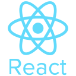
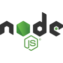
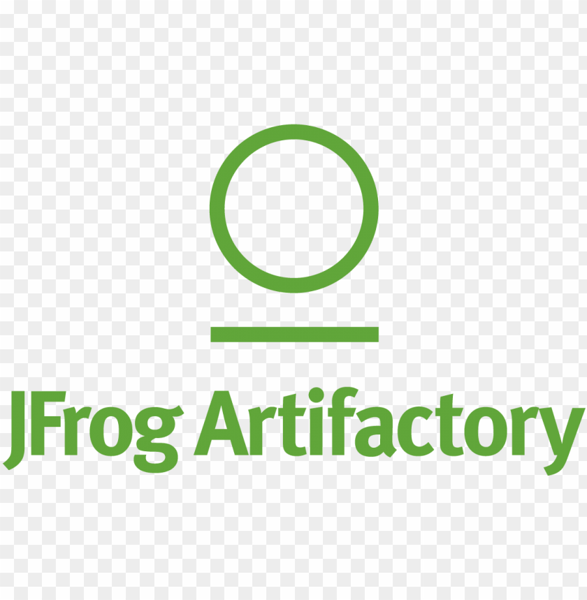
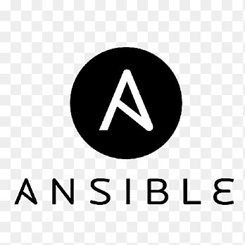

<h1  align="center">

</h1>

<h3 align="center">A passionate learner and future Software Engineer from India</h3>

-   🌱 I’m currently learning **React.JS & Next.JS**

-   👯 I’m looking to collaborate on **Open Source**

-   🤝 I’m looking for help with **AI/ML**

-   💬 Ask me about **React, Next.JS, C, C++, Python, JAVA, DSA**

-   📫 How to reach me [prashantshakya43602003@gmail.com](mailto:prashantshakya43602003@gmail.com)

-   📄 Know about my experiences [My Resume](https://drive.google.com/file/d/1P0oVASZmEpxRyW99dLXVWAPZdPdixE_U/view?usp=sharing)

-   ⚡ Fun Fact **Talk is cheap. Show me the code**
 
 
<h2 align="center">⚡ Connect With Me ⚡</h2>
<h5  align="center">
<a  href="https://linkedin.com/in/prashant162003"  title="LinkedIn Profile"> LinkedIn</a>
&emsp;
<a  href="https://www.hackerrank.com/profile/prashant_162003"  title="HackerRank Profile"> HackerRank</a>
&emsp;
<a  href="https://auth.geeksforgeeks.org/user/prashantsagarshakya"  title="GFG Profile"> GFG</a>
&emsp;
<a  href="https://www.codechef.com/users/prashant162003"  title="CodeChef Profile"> CodeChef </a>
&emsp;
<a  href="https://codeforces.com/profile/prashant.sagar.shakya"  title="CodeForces Profile"> CodeForces </a>
&emsp;
<a  href="https://leetcode.com/Prashant162003/"  title="LeetCode Profile"> Leetcode</a>
</h5>

<h2 align="center">🔥 Languages & Frameworks & Tools & Abilities 🔥</h2>

&ensp;

&ensp;
&ensp;

&ensp;

&ensp;

&ensp;

&ensp;

&ensp;

&ensp;

&ensp;

&ensp;

&ensp;

&ensp;

&ensp;

&ensp;

&ensp;

&ensp;

&ensp;

&ensp;

&ensp;

&ensp;

&ensp;

&ensp;

&ensp;

&ensp;

&ensp;

&ensp;

&ensp;
<h2 align="center">⚡ Stats ⚡</h2>
 

         

 

 

